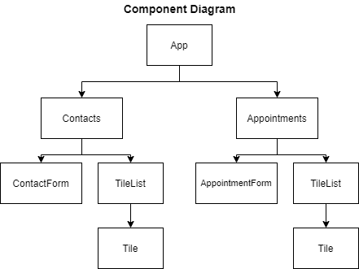

# Appointment Planner #  
[App hosted on Here](https://vromero-appointment-planner.netlify.app/)

**Sumary - Ordered by steps**  
[Project Goals](#project-goals)  
[Component Diagram](#diagram)  
[Project Requirements](#project-requirements)  
[App Requirements: - App.js](#app-requirements---appjs)  
[ContactsPage Requirements](#contactspage-requirements)  
[ContactForm Requirements](#contactform-requirements)  
[TileList Requirements](#tilelist-requirements)  
[Tile Requirements](#tile-requirements)  
[AppointmentsPage Requirements](#appointmentspage-requirements)  
[AppointmentForm Requirements](#appointmentform-requirements)  
[ContactPicker Requirements](#contactpicker-requirements)

  
## Overview ##  
Instead of a step-by-step tutorial, this project contains a series of open-ended requirements which describe the project you’ll be building. There are many possible ways to correctly fulfill all of these requirements, and you should expect to use the internet, Codecademy, and other resources when you encounter a problem that you cannot easily solve.  

[Back to top](#appointment-planner)
  
## Project Goals ##
In this project, you will use functional React components to create an app that manages contacts and appointments. The app consists of two pages: one to view and add contacts and one to view and add appointments. 
   
  
  
The requirements section will walk through implementing the app from the topmost component down. If you would like to implement it in a different order feel free to do what is comfortable for you.  
  
[Back to top](#appointment-planner)  

## Project Requirements ##  

Implement App as a stateful component that maintains appointments and contacts. It should also pass those values, along with callback functions to update those state values, to its child components.  
   
[Back to top](#appointment-planner)  
 
### App Requirements: - App.js ###
  
- Keep track of the contacts and appointments data, each being an array of objects
- Define a callback function that, given a name, phone number, and email, adds a new contact object with that data to the array of contacts
- Define a callback function that, given a title, contact, date, and time, adds a new appointment object with that data to the array of appointments
- Pass the array of contacts and the appropriate callback function as <em>props</em> to the ContactsPage component
- Pass the appointments array, contacts array, and the add appointment function as <em>props</em> to the AppointmentsPage component  
    
[Back to top](#appointment-planner)  

### ContactsPage Requirements: ###  
  
- Receive two <em>props</em>:
    - The current list of contacts
    - A callback function for adding a new contact
- Keep track of three local state values: the current name, phone, and email entered into the form
- Check for duplicates whenever the name in the form changes and indicate the name is a duplicate
- Only add a new contact on form submission if it does not duplicate an existing contact’s name
- A successful submission should clear the form
- In the Add Contact section, render a ContactForm with the following passed via <em>props</em>:
    - local state variables
    - local state variable setter functions
    - handleSubmit callback function
- In the Contacts section, render a TileList with the contact array passed via <em>props</em>  
  
[Back to top](#appointment-planner)  
  
### ContactForm Requirements: ###  
  
- Render a form with:
    - The onSubmit attribute set
    - 3 controlled \<input> elements, one for each piece of contact data
    - A submit button
- Include a pattern attribute to the phone \<input> with a regex that matches the phone locale of your preference
  
[Back to top](#appointment-planner)  

### TileList Requirements: ###  
  
- Receive one prop:
    - An array of objects to render as a list  
- Use the array passed via <em>props</em> to iteratively render Tile components, passing each object in the array as a prop to each rendered Tile component  

The requirements for the TileList component are generalized and allow it to be shared by the ContactsPage and AppointmentsPage components. As long as an array of objects with either the contact data or appointments data is passed then the content will be handled appropriately.
  
[Back to top](#appointment-planner)  

### Tile Requirements: ###  
  
- Receive one prop:
    - An object  
- Iterate over the values in the object, passed in via <em>props</em>, and render a \
 element for each value  
- Give a <em>className</em> of "tile-title" to the first \
 element  
- Give a <em>className</em> of "tile" to all other \
 elements  
  
Just like the TileList component, the Tile component is generalized to work with data from any object. This allows it to be used in both the ContactsPage and AppointmentsPage components.  
    
[Back to top](#appointment-planner)  

### AppointmentsPage Requirements: ###  
    
- Receive three <em>props</em>:
    - The current list of appointments
    - The current list of contacts
    - A callback function for adding a new appointment
- Keep track of four local state variables, the current title, contact, date, and time entered into the form
- Add a new appointment on form submission
- Clear the form on submission
- In the Add Appointment section, render an AppointmentForm with the following passed via <em>props</em>:
    - local state variables
    - local state variable setter functions
    - handleSubmit callback function
- In the Appointments section, render a TileList with the appointment array passed via <em>props</em>  
    
[Back to top](#appointment-planner)  

### AppointmentForm Requirements: ###  
  
- Render a form with:
    - The onSubmit attribute set to the callback function passed in via <em>props</em>
    - 3 controlled input components, to be used for the title, date and time appointment data
    - A ContactPicker component with the contacts list passed in via <em>props</em>
    - A submit button
- Use <em>getTodayString( )</em> to set the min attribute of the date <em>input</em>  
    
[Back to top](#appointment-planner)  

### ContactPicker Requirements: ###  
  
- Receive 2 <em>props</em>:
    - The array of contacts
    - A callback function to handle when the <em>onChange</em> event is triggered
- Render a <em>select</em> element with the <em>onChange</em> attribute set to the callback passed in via <em>props</em>
- Have a default first option element that indicates no contact is selected
- Iteratively add <em>option</em> elements using the contact names from the array passed in via <em>props</em>
  
[Back to top](#appointment-planner)  
